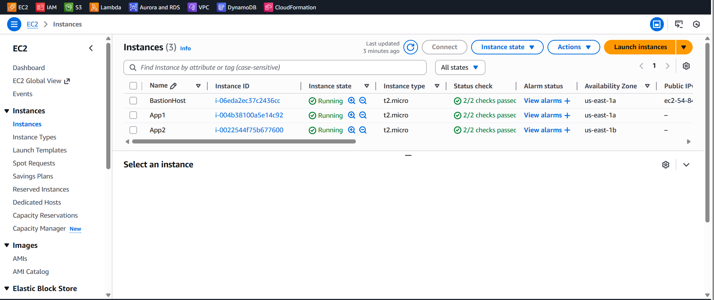
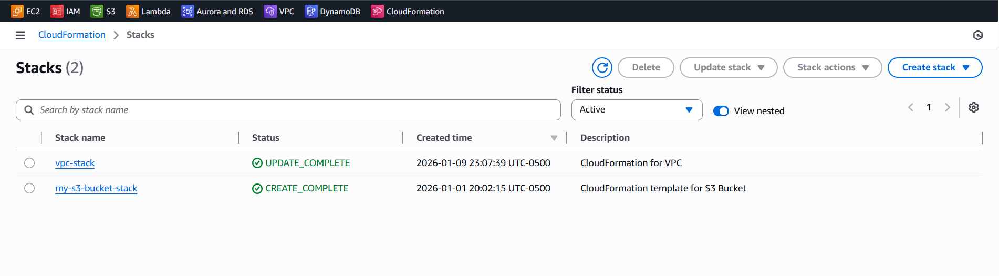

# AWS Infrastructure: Secure 3-Tier VPC Architecture

This project demonstrates how to build a professional and secure network on AWS using **Infrastructure as Code (IaC)**. By using CloudFormation, I automated the creation of a resilient environment that follows industry best practices.

## Architecture Visualization




---

## The Goal of the Project

The main idea was to create a network that is both secure and reliable. I designed it to keep the most important parts of the application hidden from the internet while making sure the system stays online even if a data center has a problem.

## Key Features

### Reliability (Multi-AZ)
I spread the resources across two different Availability Zones. This means that if one AWS data center fails, the application can keep running in the second one.

### Network Organization
I divided the network into three layers:
* **Public Layer:** For resources that need to talk to the internet (like the Bastion Host).
* **Application Layer:** For the main code and business logic, kept in private subnets.
* **Data Layer:** For sensitive information and databases, completely isolated.

### Security First
I followed a "safety-first" approach:
* **Private Servers:** The application servers are in private sections. They do not have public IP addresses, so they cannot be reached directly from the internet.
* **The Bastion Host:** I set up a "front door" server called a Bastion Host. This is the only way to access the private servers for maintenance.
* **Restricted Access:** I configured security rules so each part of the system only talks to the parts it absolutely needs to.

---

## Why This Matters for a Business

Using code to build a network like this saves time and prevents human error. It also makes the environment much harder to hack because the most important parts are hidden behind multiple layers of security.

This project shows my ability to plan a cloud network, automate the setup, and follow industry security standards.

## Project File

* [VPC CloudFormation Template](vpc.yaml)

## How to Run It

You can deploy this entire setup using the AWS CLI with this simple command:

```bash
aws cloudformation create-stack \
--stack-name my-vpc-stack \
--template-body file://template.yaml \
--capabilities CAPABILITY_NAMED_IAM
